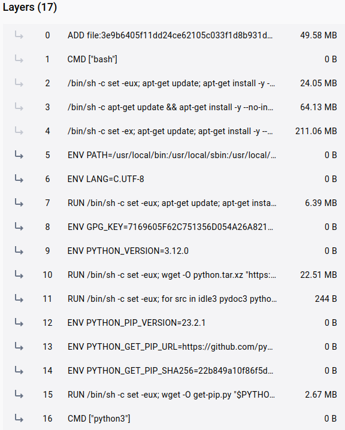
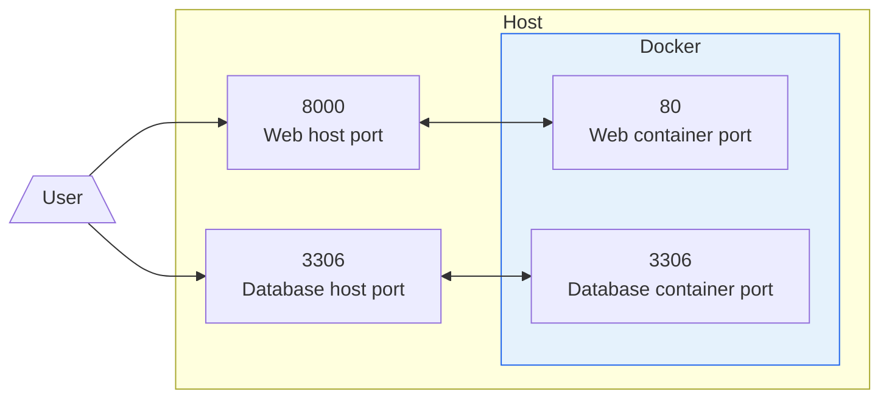
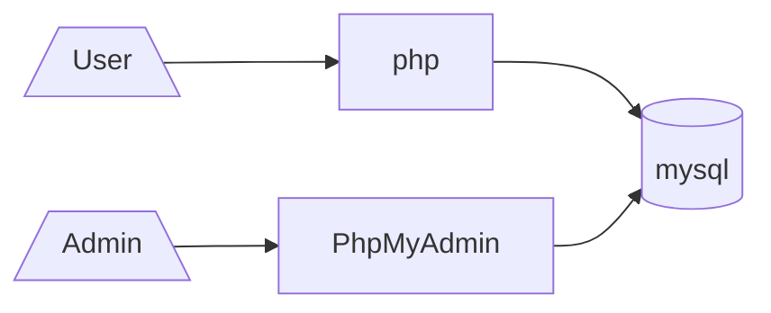

# Introduction to Docker

<qrcode width="200" />

<!-- New section -->

## Why do we need virtualization?

Applications in general need to interact with the operating system, the hardware, and other applications.

If even an element of the system changes, the application may not work as expected.

<!-- .element: class="fragment" -->

<a target="_blank" href="https://www.redbubble.com/i/magnet/Shrug-It-Works-On-My-Machine-Funny-Programmer-Excuse-programming-meme-by-ProgrammingMeme/65289679.TBCTK">
    
</a>

<!-- .element: class="fragment" -->

<!-- New subsection -->

### Virtual machines

<div class="cols">

<a target="_blank" href="https://www.docker.com/resources/what-container/">
    
</a>

<div>

**Virtual Machines** (VMs) are a great way to improve reproducibility.

They use a very complex software, the **hypervisor**, to emulate the hardware and the operating system.
They are (mostly) completely independent from the host system.

<!-- .element: class="fragment" -->

</div>

</div>

<!-- New subsection -->

### Containers

<div class="cols">

<a target="_blank" href="https://www.docker.com/resources/what-container/">
    
</a>

<div>

**Containers** are a lightweight alternative to VMs.

They use some features of the Linux kernel, namely **namespaces** and **cgroups**, to completely isolate a process from the rest of the system.
They can't emulate different kernel or hardware.

<!-- .element: class="fragment" -->

</div>

</div>

<!-- New section -->

## Docker

<div class="cols">

<a target="_blank" href="https://www.docker.com">
    
</a>

[Docker](https://www.docker.com) is the most popular containerization software.  
Some alternatives are [Podman](https://podman.io/) or [LXC](https://linuxcontainers.org/).

</div>

It also provides a [registry](https://hub.docker.com/) where you can find pre-built images.

<!-- .element: class="fragment" -->

<!-- New subsection -->

### Installation

Since Docker is specifically built with the Linux kernel in mind, it is not natively supported on Windows and macOS.
It needs to spin up a virtual machine to run Linux.

[Docker Desktop](https://www.docker.com/products/docker-desktop) handles everything for you.

<!-- .element: class="fragment" -->

- [Windows](https://docs.docker.com/docker-for-windows/install/)
- [Mac](https://docs.docker.com/docker-for-mac/install/)
- [Linux](https://docs.docker.com/engine/install/)
  - Docker Desktop ([will use a VM](https://docs.docker.com/desktop/faqs/linuxfaqs/))
  - Docker Engine

<!-- .element: class="fragment" -->

<!-- New subsection -->

### Images

<div class="cols">

<a target="_blank" href="https://hub.docker.com/layers/library/python/latest/images/sha256-5a2936b50ea64ce3e090c862d2482d5d90ed19ee2ceba5cf96ea171bd1dcba67?context=explore">
    
</a>

<div>

An **image** is a read-only template with instructions for creating a Docker container.

They are made up of **layers** that are stacked on top of each other, like git commits.

<!-- .element: class="fragment" -->

Only the top layer is writable.

<!-- .element: class="fragment" -->

</div>

</div>

<!-- New subsection -->

### Dockerfile

Dockerfiles are the instructions to build an image.

```dockerfile
FROM python:3.9.7-slim-buster # Base image

WORKDIR /app # Working directory (creates it if it does not exist)

COPY requirements.txt requirements.txt # Copy files from host to container

RUN pip install -r requirements.txt # Run a command in the container

COPY . . # Copy files from host to container

ENTRYPOINT ["python", "main.py"] # Run a command as soon as the container starts
```

<!-- New subsection -->

### Build an image

```bash
# Build an image from the Dockerfile in the current directory
# docker build -t <image-name>:<tag> <context>
# -t: tag the image with a name
# .: use the current directory as context
docker build -t my-image:latest .
```

<!-- New subsection -->

### Run a container

```bash
# Run a container from an image
# docker run <image-name>:<tag>
# -d: run the container in detached mode
# -p: publish a container's port(s) to the host
# --name: name the container
# --rm: remove the container when it exits
docker run -d -p 5000:5000 --name my-container --rm my-image:latest
```

<!-- New subsection -->

### Storage

<div class="cols">

<a target="_blank" href="https://docs.docker.com/storage/">
    
</a>

<div>

Storage inside a container is ephemeral and is destroyed when the container is removed.

**Volumes** and **bind mounts** are used to persist data.

<!-- .element: class="fragment" -->

</div>

<!-- New subsection -->

#### Transferring files into containers

- Copy them directly into the image.
  The files become part of the image and are independent from the host.

```dockerfile
# COPY <src> <dest>
# ADD has the same syntax, src can be a URL or a tar file
COPY requirements.txt requirements.txt
COPY . .
```

- Use a bind mount.
  In this case, the connection is bidirectional and continuous.

<!-- .element: class="fragment" data-fragment-index="1" -->

```bash
# docker run -v <host-path>:<container-path>
docker run -v $(pwd):/app
```

<!-- .element: class="fragment" data-fragment-index="1" -->

<!-- New subsection -->

### Ports

**Ports** are used to expose a container's network socket to the host.

This must be done explicitly when running the container with the `-p` flag.

<!-- .element: class="fragment" -->

<!-- New subsection -->

#### Port visualization



```bash
# docker run -p <host-port>:<container-port> <image-name>
docker run -p 8000:80 my-web
docker run -p 3306:3306 my-database
```

<!-- .element: class="fragment" -->

<!-- New section -->

## Docker compose

<div class="cols">

<a target="_blank" href="https://docs.docker.com/compose/">
    
</a>

<div>

[Docker compose](https://docs.docker.com/compose/) is a tool for defining and running multi-container Docker applications.

It uses a declarative YAML file to define and configure all the different services that make up the application.

<!-- .element: class="fragment" -->

</div>

</div>

<!-- New subsection -->

### docker-compose.yml

```yaml[|1|3|4-12|13-20|21-23|]
version: "3.9" # Version of the docker-compose file

services: # List of services
  db:
    image: mysql # Pull the image from Docker Hub
    volumes:
      - db-data:/var/lib/mysql # Create a volume to persist data
    environment: # Set environment variables
      MYSQL_ROOT_PASSWORD: example
      MYSQL_DATABASE: example
      MYSQL_USER: example
      MYSQL_PASSWORD: example
  web: # Name of the service
    build: . # Build the image from the Dockerfile in the current directory
    ports: # List of ports to forward
      - "5000:5000"
    volumes: # List of volumes to mount
      - .:/app
    depends_on: # List of services to start before this one
      - db

volumes: # List of volumes
  db-data: # Name of the volume
```

<!-- New section -->

## Examples

Three examples of how to use Docker in your workflow.

- [Distributing a Haskell script](#distributing-a-haskell-script)
- [Running Qiskit in a Jupyter Notebook](#running-Qiskit-in-a-jupyter-notebook)
- [Web architecture with php and mysql](#web-architecture-with-php-and-mysql)

<!-- New subsection -->

<!-- .slide: id="distributing-a-haskell-script" -->

### Distributing a Haskell script

You have a Haskell script that you want to distribute to other people.  
They may not have the whole Haskell toolchain installed or they may be unfamiliar with it.  
Docker provides easy portability.

```dockerfile
FROM haskell:slim       # Official base image (https://hub.docker.com/_/haskell)
COPY main.hs .          # Copy the script into the container
RUN ghc -o main main.hs # Compile the script
ENTRYPOINT ["./main"]   # Run the script as soon as the container starts
```

<!-- .element: class="fragment" -->

```bash
docker build -t my-haskell-script .   # Build the image
docker run -it --rm my-haskell-script # Create and run the container
```

<!-- .element: class="fragment" -->

<!-- New subsection -->

### Running Qiskit in a notebook

<!-- .slide: id="running-Qiskit-in-a-jupyter-notebook" -->

You want to run a Jupyter Notebook with Qiskit on a machine that does not have nor want Python and the right packages installed.
Docker provides immediate access to the right environment without polluting the host system.

```dockerfile
FROM quay.io/jupyter/datascience-notebook                           # Official base image (https://quay.io/repository/jupyter/datascience-notebook)
USER root                                                           # Switch to root user
COPY requirements.txt /tmp/                                         # Copy the requirements file into the container
RUN pip install --no-cache-dir --requirement /tmp/requirements.txt  # Install the requirements
```

<!-- .element: class="fragment" -->

```bash[|1|2-6|2|3|4|5|6|]
docker build -t jupyter-qiskit-example .  # Build the image
docker run -it --rm \                     # Create and run the container.
  -p 8888:8888 \                          # Forward port 8888 to the host
  -v $(pwd)/notebooks:/home/jovyan/work \ # Bind mount the notebooks directory
  -e NB_UID=$(id -u) -e NB_GID=$(id -g) -e GRANT_SUDO=yes \ # Env vars
  jupyter-qiskit-example
```

<!-- .element: class="fragment" -->

<!-- New subsection -->

### Web architecture with php and mysql

<!-- .slide: id="web-architecture-with-php-and-mysql" -->

You want to run a php application with a mysql database.



```bash
docker compose up -d # Run the application in detached mode
docker compose down  # Stop the application
docker volume prune  # Remove all unused volumes
```

<!-- .element: class="fragment" -->

<!-- New section -->

## Commands

A collection of the most common commands you may need

<!-- New subsection -->

### Images commands

```bash
# Build an image
docker build -t <image-name>:<tag> <context>
# List all images
docker images
# Remove an image
docker rmi <image-name>:<tag>
# Remove all images
docker rmi $(docker images -q)
# Remove all dangling images
docker image prune
```

<!-- New subsection -->

### Container creation commands

```bash
# Create and run a container from an image
# docker [OPTIONS] run <image-name>:<tag>

# (some) OPTIONS:
# -it: run the container in interactive mode with terminal attached
# -d: run the container in detached mode
# -p: publish a container's port(s) to the host
# --name: name the container
# --rm: remove the container when it exits
# -v <host-path>:<container-path>: mount a host directory to a container directory
# -v <volume-name>:<container-path>: mount a volume to a container directory
# --env-file <file>: load environment variables from a file
# -e <key>=<value>: set an environment variable
# --entrypoint <command>: run a command as soon as the container starts
```

```bash
docker run -d -p 5000:5000 -v my-volume:/app --name my-container my-image:latest
docker run -it -v ./app:/app my-image:latest
docker run -e MYSQL_PASSWORD=pass --rm my-image:latest
docker run -it --entrypoint "/bin/bash" my-image:latest
```

<!-- New subsection -->

### Container management commands

```bash
# List all running containers
docker ps
# List all containers
docker ps -a
# Stop a container
docker stop <container-name>
# Stop all running containers
docker stop $(docker ps -q)
# Remove a container
docker rm <container-name>
```

<!-- New subsection -->

### Container interaction commands

```bash
# Run a command in a running container
docker exec <container-name> <command>
# Attach a terminal to a running container
docker exec -it <container-name> /bin/bash
# Show logs of a container
docker logs <container-name>
# Show logs of a container in real time
docker logs -f <container-name>
```

<!-- New subsection -->

### Volume commands

```bash
# Create a  named volume
docker volume create <volume-name>
# List all volumes
docker volume ls
# Remove a volume
docker volume rm <volume-name>
# Remove all unused volumes
docker volume prune
```

<!-- New subsection -->

### Docker compose commands

```bash
# Run the application
docker compose up -d
# Force rebuild of images
docker compose up --build
# Run a single container
docker compose up <service-name>
# Stop the application
docker compose down
# List all running containers
docker compose ps
```

<!-- New section -->

## References

- [Docker](https://www.docker.com/)
- [Docker Hub](https://hub.docker.com/)

<!-- New subsection -->

## Images

- [It works on my machine!](https://www.redbubble.com/i/magnet/Shrug-It-Works-On-My-Machine-Funny-Programmer-Excuse-programming-meme-by-ProgrammingMeme/65289679.TBCTK)
- [Docker logo and VM vs Containers images](https://www.docker.com/resources/what-container/)
- [Docker compose logo](https://codeblog.dotsandbrackets.com/quick-intro-to-docker-compose/compose-logo/)
