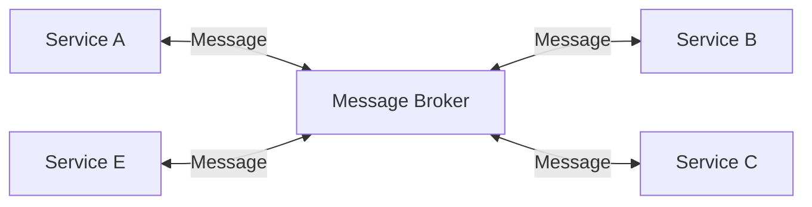

# EICSymAware architecture

<!-- New section -->

## Background

A quick tour of some concepts that will be used in the following sections.

<!-- New subsection -->

### What is a module in Python?

A module is a file, normally ending with `.py`, containing Python definitions and statements.
The name of the module is the same of the name of the file without the `.py` extension.
A folder containing a file named `__init__.py` becomes a module and can be imported.

```bash
└── constant.py # This is a module named `constant`
```

<!-- .element: class="fragment" -->

```py
import constant
```

<!-- .element: class="fragment" -->

<!-- New subsection -->

### What is a package in Python?

A package is a collection of modules.
It usually consists of a folder containing a file named `__init__.py` and a collection of modules inside it.

```bash
eicsymaware # package
├── __init__.py
├── mpi # sub package
│   ├── __init__.py
│   ├── __main__.py
│   └── constant.py
└── sisw # sub package
    ├── __init__.py
    ├── __main__.py
    └── constant.py
```

<!-- .element: class="fragment" -->

```py
import eicsymaware.mpi
import eicsymaware.sisw
```

<!-- .element: class="fragment" -->

<!-- New subsection -->

### What is a package namespace in Python?

Implicit namespaces where introduced in Python 3.3 as a way to put together completely independent python packages under the same namespace.

```bash
eicsymAware-mpi
└── eicsymaware # namespace (no __init__.py)
    └── mpi # package (__init__.py)
        ├── __init__.py
        ├── __main__.py
        └── constant.py

eicsymAware-sisw
└── eicsymaware  # namespace (no __init__.py)
    └── sisw # package (__init__.py)
        ├── __init__.py
        ├── __main__.py
        └── constant.py
```

<!-- .element: class="fragment" -->

```py
import eicsymaware.mpi
import eicsymaware.sisw
```

<!-- .element: class="fragment" -->

<!-- New subsection -->

### What is a distributed architecture?

A distributed architecture uses a collection of independent services that communicate with each other to perform a task.
The communication between services can be synchronous or asynchronous.
Usually the communication is done through a message broker.



<!-- .element: class="fragment" -->

<!-- New subsection -->

### What are Git submodules?

Git submodules are a way to include a git repository inside another git repository by only referencing a specific commit.
it is possible to clone a repository recursively, creating a local copy of the whole project.

```bash
git submodule add <repository> <local_path>
```

<!-- .element: class="fragment" -->

<!-- New section -->

## Options

Some possible options for the architecture of EICSymAware.

<!-- New subsection -->

### Option 1: Subpackages/Packages with monorepo

The simplest approach would be to have a single repository containing all the packages.
They could still be organized in subpackages and they would all be under the same repository.
Packaging would be easier, as only one python-package would need to be published, and the configuration would be centralized.
Development must be carefully split between branches to avoid conflicts.

<!-- New subsection -->

| Pros                                   | Cons                                                                        |
| -------------------------------------- | --------------------------------------------------------------------------- |
| Easy to configure                      | The subpackages are more coupled together (there is a single configuration) |
| Easy to distribute                     | Global choices could affect everyone else's work                            |
| Easy to enforce common coding standard | Platform restricted to Python (and CPython)                                 |
|                                        | Some risks of merging conflicts                                             |

<!-- New subsection -->

```bash
# Multiple packages in a single repository
eicsymAware
├── pyproject.toml
└── src
    ├── mpi # package
    │   ├── __init__.py
    │   ├── __main__.py
    │   └── mpi.py
    └── sisw # package
        ├── __init__.py
        ├── __main__.py
        └── sisw.py

# Subpackages in a single repository
eicsymAware
├── pyproject.toml
└── src
    └── eicsymaware # package
        ├── __init__.py
        ├── mpi # sub package
        │   ├── __init__.py
        │   ├── __main__.py
        │   └── mpi.py
        └── sisw # sub package
            ├── __init__.py
            ├── __main__.py
            └── sisw.py
```

<!-- New section -->

### Option 2: Subpackages with multiple repo (submodules)

Similar to the previous option, but with each package in a different repository.
They would all come together in a single repository using git submodules.

<!-- New subsection -->

| Pros                                     | Cons                                                        |
| ---------------------------------------- | ----------------------------------------------------------- |
| Easy to configure                        | Need for correct local setup for each package               |
| Easy to distribute                       | Harder partial integration testing                          |
| Each repository could work independently | Platform restricted to Python (and CPython)                 |
|                                          | Need to handle (unfrequent) changes to global configuration |

<!-- New subsection -->

```bash
# Multiple packages in a single repository
eicsymAware # (main repository)
├── pyproject.toml
└── src
    ├── mpi # package (git submodule)
    │   ├── __init__.py
    │   ├── __main__.py
    │   └── mpi.py
    └── sisw # package (git submodule)
        ├── __init__.py
        ├── __main__.py
        └── sisw.py

# Subpackages in a single repository
eicsymAware # (main repository)
├── pyproject.toml
└── src
    └── eicsymaware # package
        ├── __init__.py
        ├── mpi # sub package (git submodule)
        │   ├── __init__.py
        │   ├── __main__.py
        │   └── mpi.py
        └── sisw # sub package (git submodule)
            ├── __init__.py
            ├── __main__.py
            └── sisw.py
```

<!-- New section -->

### Option 3: Namespaces with multiple repo

Using the implicit namespace packages introduced in Python 3.3, it is possible to have completely independent packages under the same namespace.
Each can be installed and managed on its own, but when imported they share a common prefix, which would be the namespace.

<!-- New subsection -->

| Pros                                        | Cons                                                     |
| ------------------------------------------- | -------------------------------------------------------- |
| Completely independent packages             | Harder to enforce coding standard (testing, linting)     |
| Can be versioned easily                     | Folder structure and configuration duplication           |
| All sections can be installed independently | Slightly articulate configuration and tooling management |
| Under the same namespace                    | Platform restricted to Python (and CPython)              |
| Each repository could work independently    |

<!-- New subsection -->

```bash
eicsymAware # Package mpi (repository)
├── pyproject.toml
└── src
    └── eicsymaware # namespace
        └── mpi # package
            ├── __init__.py
            ├── __main__.py
            └── mpi.py


eicsymAware # Package sisw (repository)
├── pyproject.toml
└── src
    └── eicsymaware # namespace
        └── sisw # package
            ├── __init__.py
            ├── __main__.py
            └── sisw.py
```

<!-- New section -->

### Option 4: Distributed architecture with multiple repo

The most complex option would be to have a distributed architecture.
In this case, each component would be a completely independent service, with its own repository.
The communication between services would be done through a message broker (e.g. RabbitMQ, Kafka, etc.).

<!-- New subsection -->

| Pros                                                           | Cons                                                             |
| -------------------------------------------------------------- | ---------------------------------------------------------------- |
| Completely independent components                              | Harder to enforce coding standards (testing, linting)            |
| Allows for different architecture and platforms to communicate | More articulate configuration and tooling management             |
| Works naturally in a distributed setting                       | Less efficient when a single machine would be sufficient         |
| Each repository could work independently                       | Introduction of external tooling to handle service communication |
| Enforced use of APIs                                           | Way more complex configuration                                   |

<!-- New subsection -->

```bash
eicsymAware # Package mpi (in python)
├── pyproject.toml
└── src
    └── eicsymaware # namespace
        └── mpi # package
            ├── __init__.py
            ├── __main__.py
            └── mpi.py


eicsymAware # Package sisw (in Java)
├── pom.xml
└── src/main/java
    └── eicsymaware/sisw # package
        ├── main.java # main class
        └── sisw.java # sisw class
```

<!-- New section -->

## Code standards

Enforcing a common code standard is important to keep the codebase clean and readable.
There are many automatic tools that can help with this task, such as `black`, `pylint`, `mypy`, `isort`, etc.

<!-- New subsection -->

### Code style

The [Google Python Style](https://google.github.io/styleguide/pyguide.html) is one of the most popular, and it is supported by most linters and formatters.
It is not vital to memorize all the rules, since they will be enforced by the tools.

Just the most important ones:

<!-- .element: class="fragment" data-fragment-index="1" -->

- 4 spaces indentation
- 80 characters line length
- snake_case for variables and functions (prefix with \_ if module or class private)
- PascalCase for classes (prefix with \_ if module private)
- UPPER_CASE for constants

<!-- .element: class="fragment" data-fragment-index="1" -->

<!-- New subsection -->

### Comments and docstrings

There are a lot of styles to choose from.
The most popular are:

- [Google](https://google.github.io/styleguide/pyguide.html#38-comments-and-docstrings)
  - [Example](https://www.sphinx-doc.org/en/master/usage/extensions/example_google.html)
- [Numpy](https://numpydoc.readthedocs.io/en/latest/format.html)
  - [Example](https://www.sphinx-doc.org/en/master/usage/extensions/example_numpy.html#example-numpy)
- [Sphinx](https://sphinx-rtd-tutorial.readthedocs.io/en/latest/docstrings.html)

I would personally choose the Google style, as it is pretty lean and easy to write and read.
The Numpy style is also pretty good and it's less dependent on indentation.

<!-- .element: class="fragment" -->

<!-- New section -->

## The importance of APIs

Even ignoring the distributed architecture, it is important to define APIs for each component.
This allows for a more modular design, where each component can be replaced with a different one, as long as it respects the API.

hence, APIs can be seen as a contract between components, where each component promises to send messages respecting the interface other components expect.

<!-- .element: class="fragment" -->

It is important to define the API as soon as possible, as it may become increasingly difficult to change them later on.
It also guides development by declaring what the goal of the component is.

<!-- .element: class="fragment" -->

<!-- New subsection -->

### Multiple shapes of APIs

The term APIs can refer to a simple function signature, a REST API, json messages, etc.

In the case of a python package or module, some `dataclasses` are probably the safest way to share data between components.

<!-- .element: class="fragment" data-fragment-index="1" -->

```py
from dataclasses import dataclass

@dataclass
class Message:
    identifier: int
    content: str
```

<!-- .element: class="fragment" data-fragment-index="1" -->
