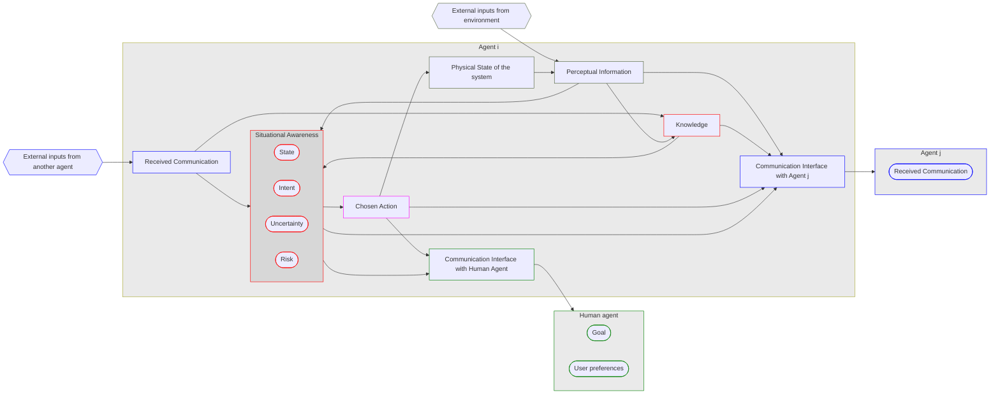
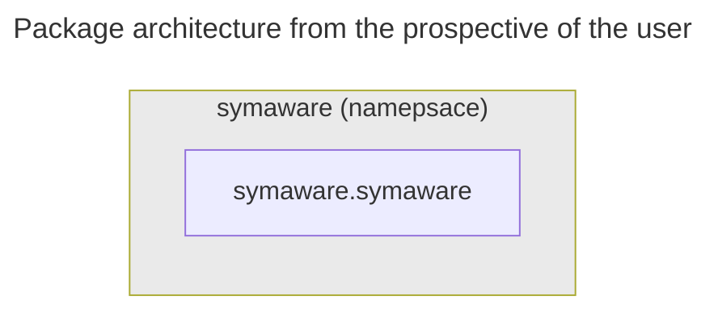
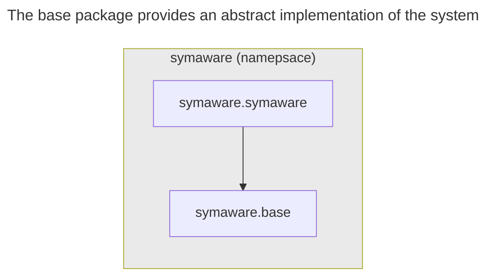
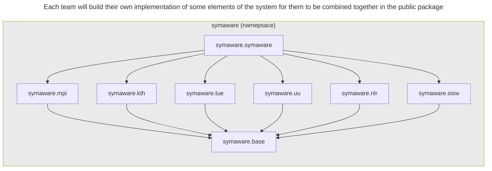
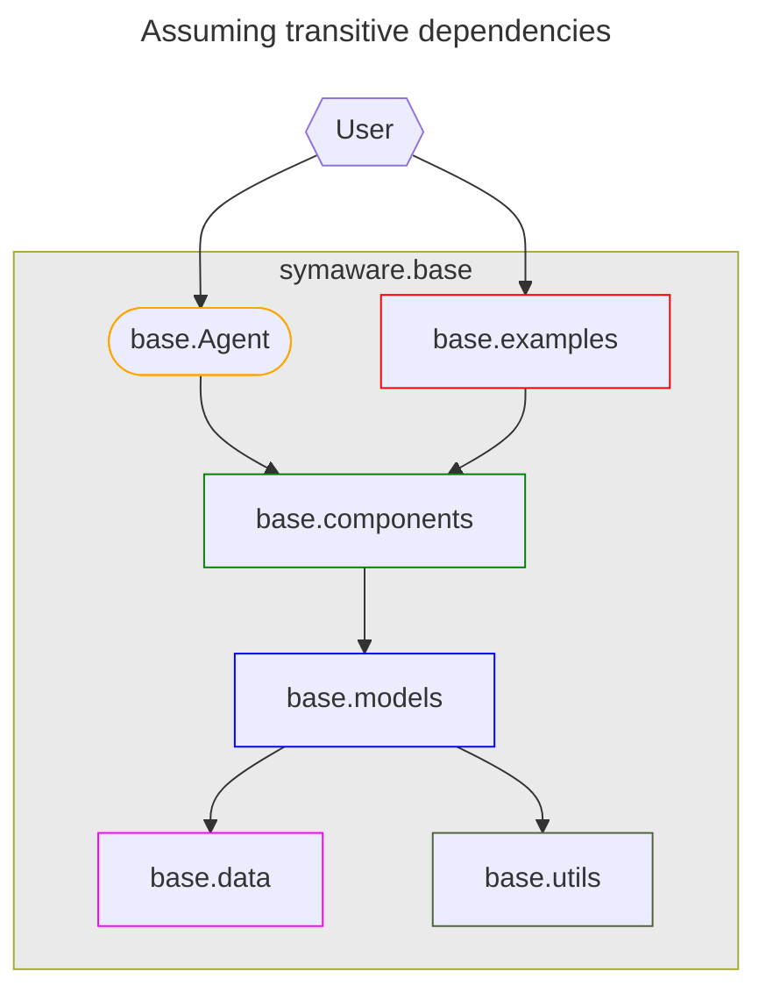
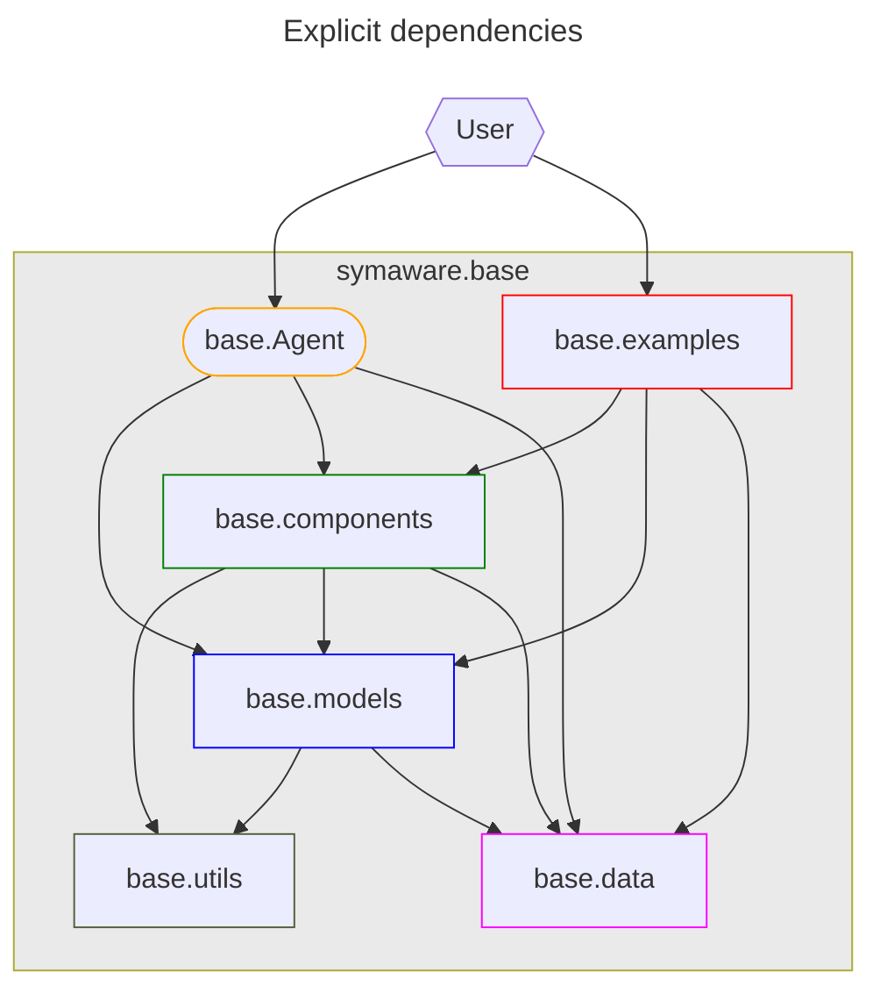
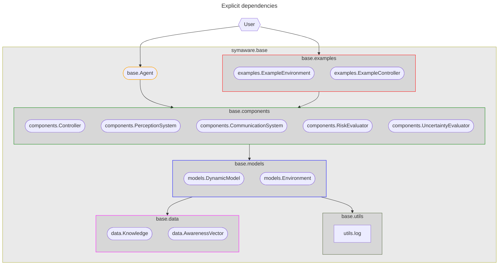
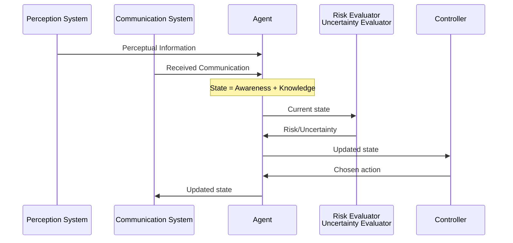

# SyimAware: Software architecture

<urltoqr width="200" />

<!-- New section -->

## High level goal

The goal is to create a collection python packages an user can easily install on their machine.

The software must allow for different component implementations to be swapped easily.

<!-- .element: class="fragment" -->

<!-- New section -->

## Project structure

<!-- New section -->

## Package architecture

All packages will be namespaced under the `symaware` namespace.
From the `symaware.base` package, each team will then develop their own implementation of one or more elements of the system.

<!-- .element: class="fragment fade-in-then-out m-unset" -->

<!-- .element: class="fragment fade-in-then-out m-unset" -->

<!-- .element: class="fragment fade-in-then-out m-unset" -->

<!-- New section -->

### Software design of `symaware.base`

The main elements of the software have been divided in subpackages in order to enforce a coarse but clear separation of concerns.

<!-- .element: class="fragment fade-in-then-out m-unset" -->

<!-- .element: class="fragment fade-in-then-out m-unset" -->

<!-- .element: class="fragment fade-in-then-out m-unset" -->

<!-- New subsection -->

### Sequence diagram

The following sequence diagram shows the interaction between the different components of the system.

