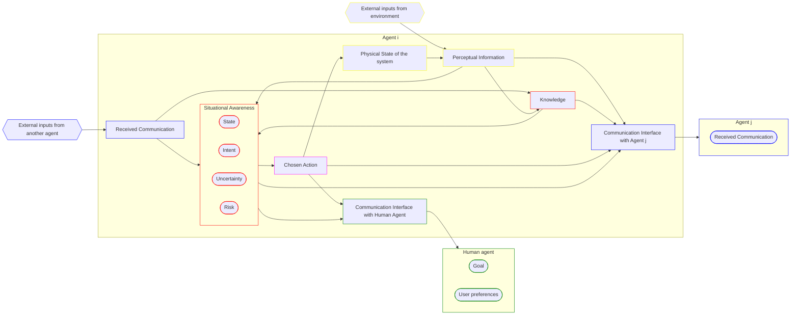
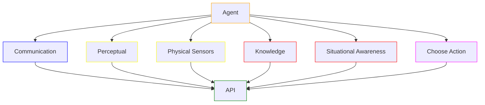
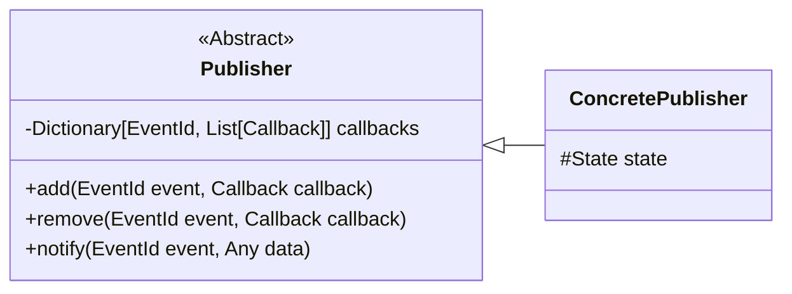
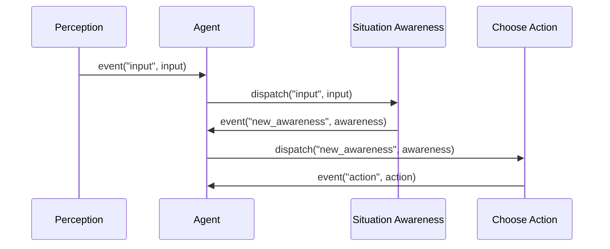
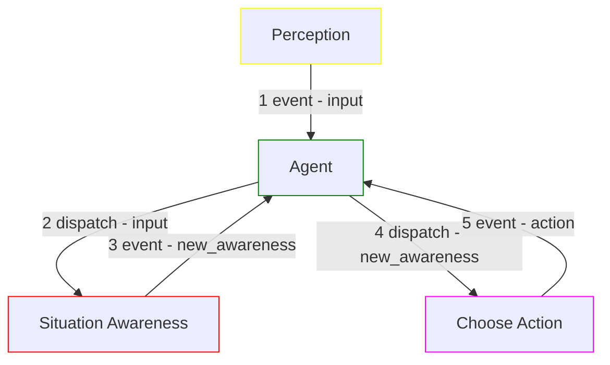
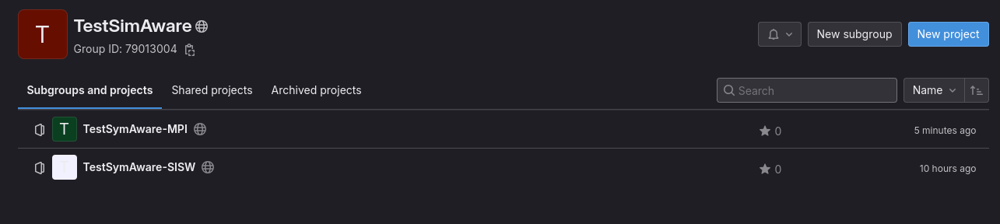
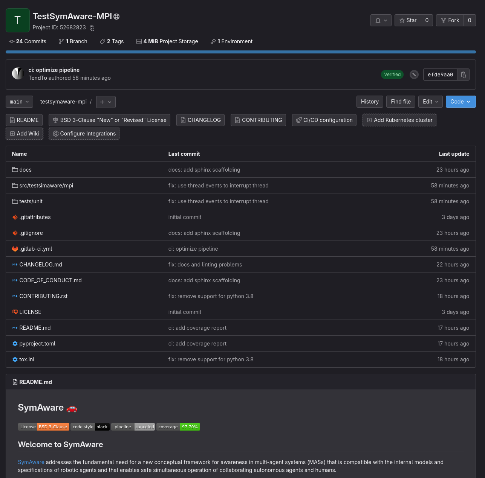
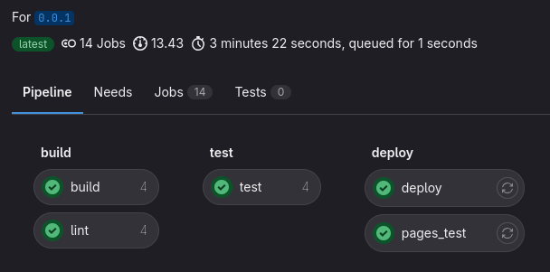
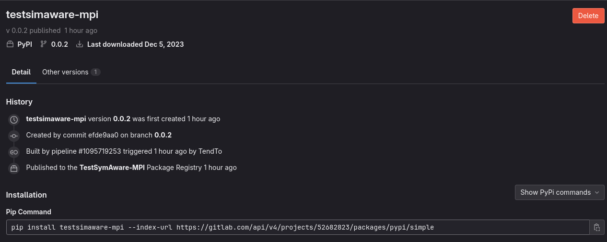

# EICSymAware scaffolding

<qrcode width="200" />

<!-- New section -->

## Presentation

<div class="cols">


<div>

**Ernesto Casablanca**

- Completed _MSc Computer Science_ @ [University of Catania](https://www.unict.it/)
- Currently _PhD Student_ @ [Newcastle University](https://www.ncl.ac.uk/)
- Extensive experience in [_software development_](https://github.com/TendTo)
- _Full-stack projects_ at [CTMobi](https://www.ctmobi.it/)

</div>

</div>

<!-- New section -->

## Requirements

What characteristics will EICSymAware have?

- Written in python
<!-- .element: class="fragment" -->
- Easy to distribute
<!-- .element: class="fragment" -->
- Independent development
<!-- .element: class="fragment" -->
- Flexible and modular architecture
<!-- .element: class="fragment" -->
- Easily interchangeable components
<!-- .element: class="fragment" -->

<!-- New subsection -->

### Written in python / Easy to distribute

The easiest way to distribute a python package is through [PyPI](https://pypi.org/).

With a properly configured [`pyproject.toml`](https://pip.pypa.io/en/stable/reference/build-system/pyproject-toml/) file and [CI/CD](https://about.gitlab.com/topics/ci-cd/) pipeline, the whole process can be automated and triggered by pushing a new tag.

<!-- .element: class="fragment" data-fragment-index="1" -->

Installation just requires `pip`:

<!-- .element: class="fragment" data-fragment-index="2" -->

```bash
pip install eicsymaware
```

<!-- .element: class="fragment" data-fragment-index="2" -->

<!-- New subsection -->

### Independent development

Each module can be developed independently with its own repository and CI/CD pipeline.

There needs to be agreement on a common API and some coding standards should be enforced (e.g. code style, docstrings, etc.).

<!-- .element: class="fragment" -->

Modules should be deployed regularly to allow for integration testing.

<!-- .element: class="fragment" -->

```bash
eicsymAware-mpi # Module from mpi (repository)
└── src
    └── eicsymaware # namespace (no __init__.py)
        └── mpi # package (__init__.py)

eicsymAware-sisw # Module from sisw (repository)
└── src
    └── eicsymaware  # namespace (no __init__.py)
        └── sisw # package (__init__.py)
```

<!-- .element: class="fragment"" -->

<!-- New subsection -->

### Flexible and modular architecture

Each component should be as independent as possible from the others.



<!-- .element: class="fragment" -->

<!-- New subsection -->

### Flexible and modular architecture

Each module will publish its own package.

An API foundation package would help enforce a common interface between components.

<!-- .element: class="fragment" data-fragment-index="2" -->

Everything will come together in a single package, the entrypoint of the project.

<!-- .element: class="fragment" data-fragment-index="3" -->



<!-- .element: class="fragment" -->

<!-- New subsection -->

### Easily interchangeable components

The components should be easily interchangeable, as long as they respect the common API.

Only the main package knows all the modules and how they communicate with each other $\implies$ it is possible to replace a each with a compatible one without affecting the others.

<!-- .element: class="fragment" -->

Adapting the [Publisher-Subscriber](https://en.wikipedia.org/wiki/Publish%E2%80%93subscribe_pattern) design pattern makes it easier to decouple the components.

<!-- .element: class="fragment" -->



<!-- .element: class="fragment" -->

<!-- New subsection -->

#### Event based communication

Working with events makes it easier to segregate the implementation of each component from the transmission of data.

<div class="cols">



<!-- .element: class="fragment" -->



<!-- .element: class="fragment" -->

</div>

<!-- New section -->

## Example

A simple example to show how the architecture could be built is currently available on [GitLab](https://gitlab.com/testsimaware).

It includes all the package configuration files, as well as ready to use testing, linting and documentation tools.
All is integrated with a CI/CD pipeline.

<qrcode url="https://gitlab.com/testsimaware" width="200">

<!-- New subsection -->

### Group

A group on GitLab is a collection of projects.



<!-- New subsection -->

### Module

Each module is a separate project.



<!-- New subsection -->

### Package

Each module publishes its own package using a CI/CD pipeline.

<div class="cols">





</div>

```bash
pip install testsimaware-mpi --index-url https://gitlab.com/api/v4/projects/52682823/packages/pypi/simple
pip install testsimaware-sisw --index-url https://gitlab.com/api/v4/projects/52755635/packages/pypi/simple
```

<!-- New subsection -->

### Agent

The agent will combine all the modules together and provide the entrypoint to the project.

```python[|1,2|4-18|6,7|8-11|19,20|]
from testsimaware.mpi import Perception
from testsimaware.sisw import SituationAwareness

class Agent:
    def __init__(self):
        self.perception = Perception()
        self.situation_awareness = SituationAwareness()
        self.perception.add("system_status", self.situation_awareness.update)
        self.situation_awareness.add("low_cpu", lambda _: self.stop)
        self.situation_awareness.add("low_memory", lambda _: self.stop)
        self.situation_awareness.add("low_disk", lambda _: self.stop)

    def start(self):
        self.perception.start()

    def stop(self):
        self.perception.stop()

agent = Agent()
agent.start()
```

<!-- New subsection -->

### Agent complete example

For a more complete example, check the [agent.py](./examples/agent.py) file.

<!-- New section -->

## Questions

Any questions or comments?
