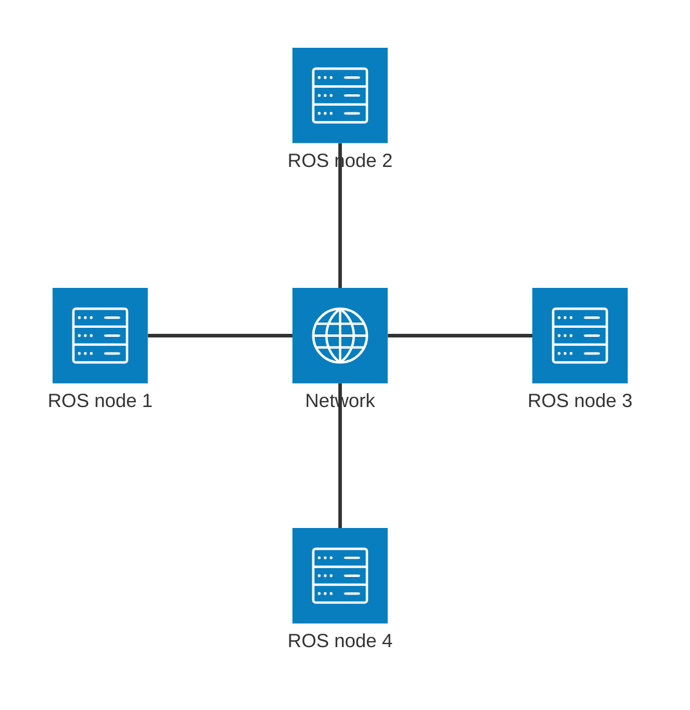
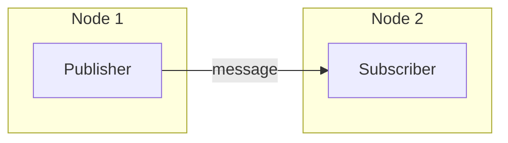
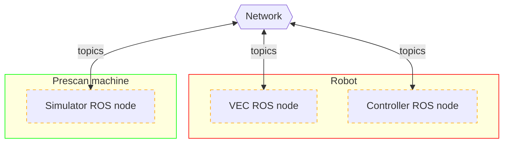
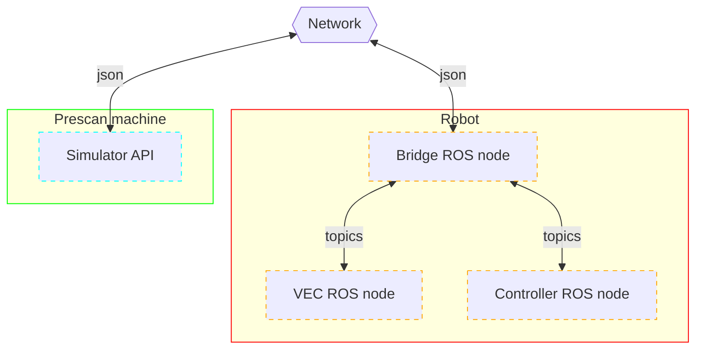
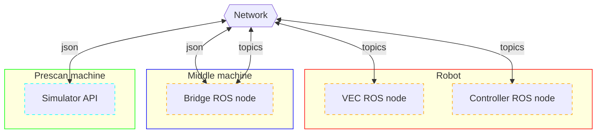
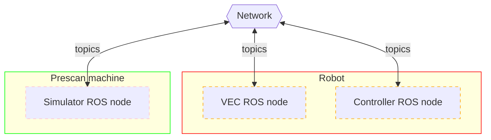

# ROS in SymAware

<!-- New section -->

## ROS

The Robot Operating System (ROS) is a set of software libraries and tools that help you build robot applications.

At its core, you can see it as a middleware that takes care of the communication between different components (called nodes).

<!-- .element: class="fragment" -->

Its success is due to the fact that it is open-source, modular, and has a large community providing support and packages.

<!-- .element: class="fragment" -->

<!-- New subsection -->

### Example of a ROS system

<!-- New subsection -->

### Topics

Nodes communicate with each other by publishing messages to topics.

<!-- New subsection -->

### Multiple topics

Each node can publish to multiple topics and subscribe to multiple topics.

<!-- New section -->

## Integrating SymAware

SymAware is a framework which can interact with multiple simulators and provides a common interface to write components that determine the behaviour of agents in the environment.

<!-- New subsection -->

### SymAware and Prescan

SymAware already supports the Prescan simulator, which is a powerful tool for simulating autonomous vehicles.

<!-- New subsection -->

### ROS nodes

<!-- New subsection -->

#### Pros and cons

| Pros                           | Cons                                                 |
| ------------------------------ | ---------------------------------------------------- |
| Direct efficient communication | Requires ROS to be installed on the Prescan machine  |
| More standard ROS approach     | SymAware goes from a Python package to a ROS package |

<!-- New subsection -->

### On Robot ROS bridge

<!-- New subsection -->

#### Pros and cons

| Pros                                               | Cons                                   |
| -------------------------------------------------- | -------------------------------------- |
| No need to install ROS on the Prescan machine      | Slower middleware communication        |
| SymAware only needs to implement the communication | Higher computational load on the Robot |

<!-- New subsection -->

### On middleware ROS bridge

<!-- New subsection -->

#### Pros and cons

| Pros                                               | Cons                                 |
| -------------------------------------------------- | ------------------------------------ |
| No need to install ROS on the Prescan machine      | Even slower middleware communication |
| SymAware only needs to implement the communication | Needs another ROS machine            |

<!-- New subsection -->

### Light ROS node

<!-- New subsection -->

#### Pros and cons

| Pros                                          | Cons                |
| --------------------------------------------- | ------------------- |
| No need to install ROS on the Prescan machine | May not be possible |
| Direct efficient communication                |                     |
