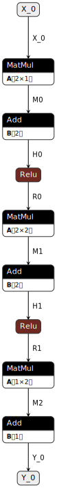
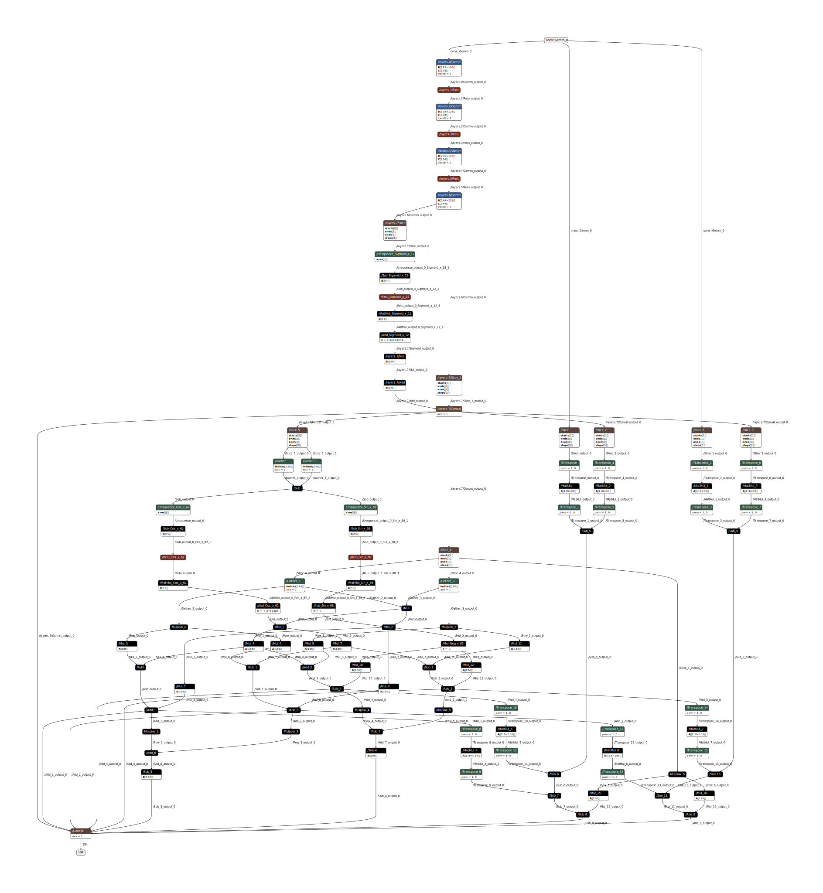
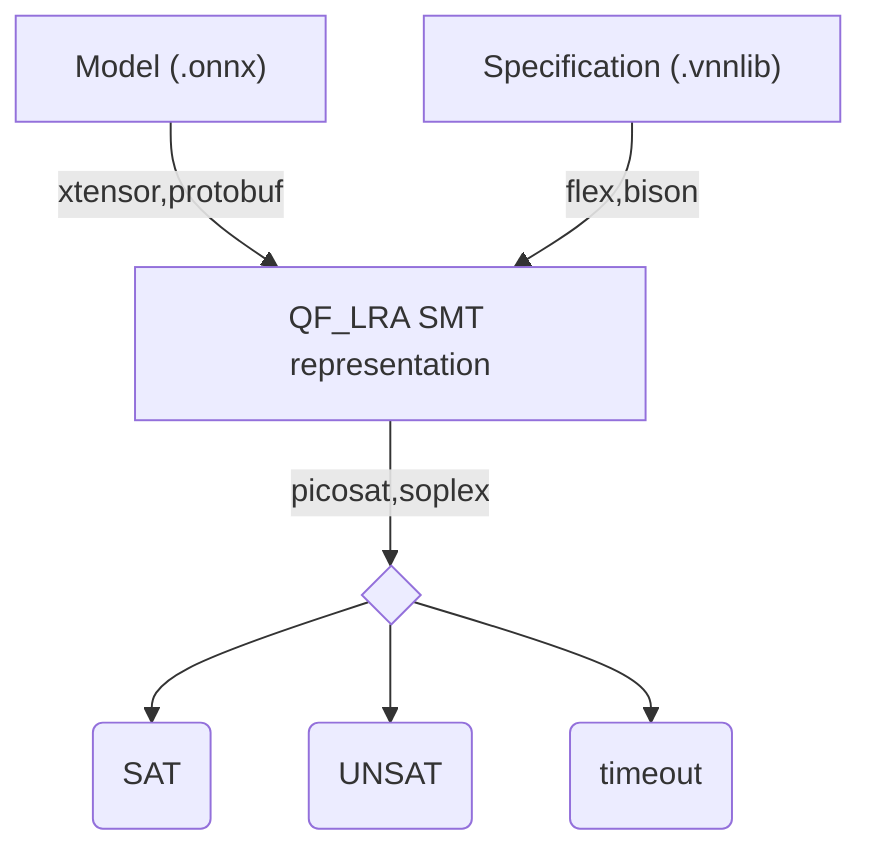
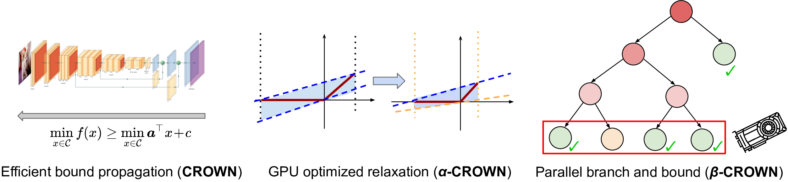

# Verification of Neural Networks

<qrcode width="200" />

<!-- New section -->

## A problem in two parts

<div class="cols">

<div>

<div class="r-stack">



<!-- .element: class="fragment fade-out"  data-fragment-index="0" -->



<!-- .element: class="fragment currently-visible" data-fragment-index="0" -->

</div>

[Netron](https://netron.app/), an [onnx](https://onnx.ai/) visualizer

</div>

<div>

```smt2
; test_small.vnnlib

(declare-const X_0 Real)
(declare-const Y_0 Real)
(assert (or
    (and
        (>= X_0 -1)
        (<= X_0 1)
        (>= Y_0 100)
    )
))
```

[vnnlib](https://www.vnnlib.org/) file format, an [smt2lib](https://smt-lib.org/) dialect

</div>

</div>

Taken from the [VNNCOMP 2021](https://sites.google.com/view/vnn2021) benchmarks

<!-- New subsection -->

### The verification



The goal is to linear the output layer of the neural network and verify the constraints

<!-- New section -->

## Common activation functions

<div class="cols">

<div>

```mermaid
%%{init: { "themeVariables": {"xyChart": {"plotColorPalette": "#ff0000"} } }}%%
xychart-beta
title "ReLU function"
x-axis x -3 --> 3.0
y-axis y 0 --> 3.0
line [0, 0, 0, 0, 0, 0, .5, 1, 1.5, 2, 2.5, 3]
```

$R(x) = \begin{cases} 0 & x < 0 \newline x & x \ge 0 \end{cases}$

</div>

<div>

```mermaid
%%{init: { "themeVariables": {"xyChart": {"plotColorPalette": "#ff0000"} } }}%%
xychart-beta
title "Leaky ReLU function"
x-axis x -3 --> 3.0
y-axis y -1 --> 3.0
line [-1, -.8, -.6, -.4, -0.2, 0, .5, 1, 1.5, 2, 2.5, 3]
```

$LR(x) = \begin{cases} ax & x < 0 \newline x & x \ge 0 \end{cases}$

</div>

</div>

<!-- New subsection -->

### Other notable activation functions

<!-- .slide: data-visibility="hidden" -->

<div class="cols">

<div>

```mermaid
%%{init: { "themeVariables": {"xyChart": {"plotColorPalette": "#ff0000"} } }}%%
xychart-beta
title "Sigmoid function"
x-axis x -8 --> 8
y-axis y 0 --> 1
line [0.0, 0.0, 0.0, 0.0, 0.0, 0.0, 0.0, 0.0, 0.0, 0.0, 0.0, 0.01, 0.02, 0.05, 0.12, 0.27, 0.5, 0.73, 0.88, 0.95, 0.98, 0.99, 1.0, 1.0, 1.0, 1.0, 1.0, 1.0, 1.0, 1.0, 1.0, 1.0]
```

$S(x) = \frac{1}{1 + e^{-x}}$

</div>

<div>

```mermaid
%%{init: { "themeVariables": {"xyChart": {"plotColorPalette": "#ff0000"} } }}%%
xychart-beta
title "Tanh function"
x-axis x -8 --> 8
y-axis y -1 --> 1
line [-1.0, -1.0, -1.0, -1.0, -1.0, -1.0, -1.0, -1.0, -1.0, -1.0, -1.0, -1.0, -1.0, -1.0, -0.96, -0.76, 0.0, 0.76, 0.96, 1.0, 1.0, 1.0, 1.0, 1.0, 1.0, 1.0, 1.0, 1.0, 1.0, 1.0, 1.0, 1.0]
```

$T(x) = \frac{e^{2x} - 1}{e^{2x} + 1}$

</div>

</div>

<!-- New subsection -->

### Linearize the activation functions

The approach used by $\alpha\text{-}\beta\text{-crown}$, winner of VNNCOMP 2021, 2022 and 2023 is to linearize the activation functions, reducing the error introduced by the approximation with tunable parameters.



[Paper](https://link.springer.com/chapter/10.1007/978-3-642-02777-2_20)

<!-- New subsection -->

### Comparison

| Tool                   | Strict bounds  | Equality on $y$ | Unbounded input | Or           | Precision    | Efficient    |
| ---------------------- | -------------- | --------------- | --------------- | ------------ | ------------ | ------------ |
| dlinear                | $\checkmark$   | $\checkmark$    | $\checkmark$    | $\checkmark$ | $\checkmark$ | $\times$     |
| $\alpha$-$\beta$-crown | $\checkmark$\* | $\times$        | $\times$        | $\times$     | $10^{-10}$   | $\checkmark$ |
| neurosat               | $\times$       | $\checkmark$    | $\times$        | $\checkmark$ | $\checkmark$ | $\checkmark$ |
| nnenum                 | $\times$       | $\checkmark$    | $\times$        | $\times$     | $10^{-10}$   | $\checkmark$ |
| Marabou                | $\times$       | $\checkmark$    | $\times$        | $\checkmark$ | $\checkmark$ | $\checkmark$ |

<!-- New section -->

## SMT components: Terms and formulae

- $f \in V_B$: propositional variables (Formula)
- $x \in V_R$: real-valued variables (Term)
- $a, c \in \mathbb{R}$: constants (Term)
- $\sim \in \\{=, \neq, <, \leq, >, \geq\\}$: comparison operators

$$
\underbrace{\underbrace{a_{11} x_1 + \dots + a_{1n} x_n + c_1}_{\text{Term}} \sim \underbrace{a_{21} x_{n + 1} + \dots + a_{2m} x_m + c_2}_{\text{Term}}}_{\text{Formula}}
$$

<!-- New subsection -->

### Conjunctive normal form

Most SMT solvers expect the input in CNF form, where $l_{ij}$ are literals

$$
( l_{00} \lor \dots \lor l_{0m_0}) \land (l_{10} \lor \dots \lor l_{1m_1}) \land \dots \land (l_{n0} \lor \dots \lor l_{nm_n})
$$

<!-- New subsection -->

### If-then-else terms

If $f, f_1, f_2$ are formulas, $\text{ite}(f, f_1, f_2)$ is a formula equivalent to $(f_1 \land f_2 ) \lor (\neg f1 \land f3 )$

If $t_1, t_2$ are terms and $f$ is a formula, $\text{term-ite}(f, t_1, t_2)$ is a term

<!-- New subsection -->

### Piecewise linear functions to ITE

Piecewise linear functions can be represented using if-then-else terms

```smt2
; ReLU
(declare-const x Real)
(declare-const y Real)

(assert (= y (ite (<= x 0) 0 x)))
```

<!-- New subsection -->

### ITE to CNF

The if-then-else term can be converted to CNF by introducing a fresh variable $c$ with the following equisatisfability relation

$f(\text{term-ite}(g, t1 , t2)) \equiv f (c) \land \text{ite}(g, t1 = c, t2 = c)$

e.g.

$$
\text{term-ite}(g, 1, 2) = \text{term-ite}(h, 3, 4) \newline \text{becomes} \newline \text{ite}(g, c = 1, c = 2) \land \text{ite}(h, c = 3, c = 4)
$$

<!-- New subsection -->

### Max encoding

The max function can be seen as a special case of an ITE term.
Exploiting its characteristics, introducing two fresh variables $a_1, a_2$ allows to encode it directly in CNF:

$$
\begin{array}{lcr}
y = \max(x_1, x_2) & \implies & (y − x_1 = a_1) \land (a_1 \ge 0) \land \newline
& & (y − x_2 = a_2) \land (a_2 \ge 0) \land \newline
& & (a1 \le 0 \lor a2 \le 0)
\end{array}
$$

<!-- New section -->

### Completeness vs Real world

SMT solvers aim for a complete approach, a mathematical solution of the problem, employing symbolic representation of the inputs and exact arithmetic (when possible).  
In the real world, however, speed of the computation is usually the main concert, hence floating point arithmetic is almost always used.

As a result, it can happen that the solution found by the SMT solver is not the same as the one computed by the neural network (e.g. [OnnxRuntime](https://onnxruntime.ai/)).

<!-- .element: class="fragment" -->

<!-- New section -->

### Work in progress

- Symbolic representation with focus on ITE and max terms
- [Efficient Term-ITE Conversion for Satisfiability Modulo Theories](https://link.springer.com/chapter/10.1007/978-3-642-02777-2_20)
- Different approaches to optimize the solution search in the exponential subproblem tree
  - [Neural Network Verification with Branch-and-Bound for General Nonlinearities](https://doi.org/10.48550/arXiv.2405.21063)
  - [Verification of Neural Network through MILP and Constraint Programming](https://unire.unige.it/bitstream/handle/123456789/8309/tesi28126601.pdf?sequence=1&isAllowed=y&group=an)
  - [Efficient Neural Network Analysis with Sum-of-Infeasibilities](https://doi.org/10.48550/arXiv.2203.11201)
- [Floating-Point Verification using Theorem Proving](https://www.cl.cam.ac.uk/~jrh13/papers/sfm.pdf)
